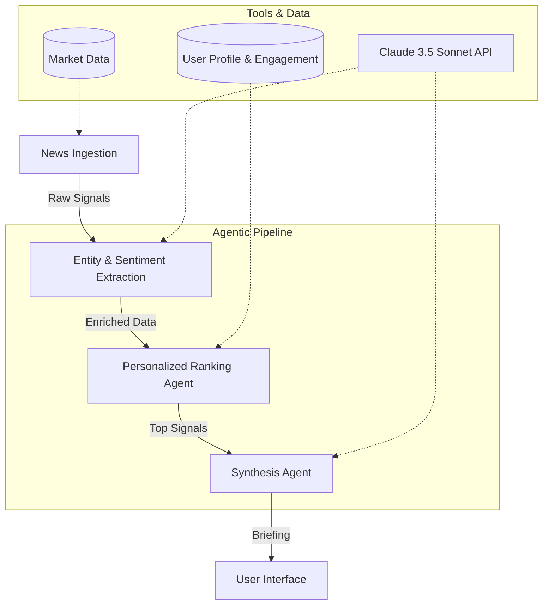

# My ET: System Architecture & Agentic Pipeline

This document outlines the architecture of the "My ET" AI-native newsroom, detailing the agent roles, communication patterns, tool integrations, and error-handling strategies.

## 1. System Overview

"My ET" operates on a **Sequential Agentic Pipeline** architecture. Instead of a single monolithic AI call, the system decomposes the news intelligence process into specialized stages, each handled by a logical "agent" or processing unit.

## 2. Agent Roles & Responsibilities

### **A. Ingestion Agent**
*   **Role**: Aggregates raw news signals from various financial sources (ET Markets, Tech, Energy, etc.).
*   **Responsibility**: Normalizes data into a standard `Article` format.
*   **Status**: Currently simulated via `MOCK_ARTICLES`.

### **B. Extraction Agent**
*   **Role**: Performs Natural Language Processing (NLP) on raw text.
*   **Responsibility**: Identifies key entities (Companies, People, Topics) and assigns a sentiment score (Bullish, Bearish, Neutral).
*   **Integration**: Uses LLM-based extraction logic to enrich metadata.

### **C. Personalized Ranking Agent**
*   **Role**: The "Intelligence Filter."
*   **Responsibility**: Calculates a `relevanceScore` for every article by cross-referencing metadata against the **User Profile** (Role, Industry, Geography) and **Engagement Data** (Clicks, Saves).
*   **Logic**:
    *   Sector Match: +40 points
    *   Portfolio Match: +50 points
    *   Watchlist Match: +30 points
    *   Engagement Boost: +5 points per interaction

### **D. Synthesis Agent**
*   **Role**: The "Newsroom Editor."
*   **Responsibility**: Takes the top-ranked signals and synthesizes them into a coherent, role-specific briefing.
*   **Integration**: Calls **Claude 3.5 Sonnet** with a dynamic system prompt that includes the user's professional context and preferred language.

## 3. Communication Patterns

The system uses a **State-Driven Sequential Pipeline**:
1.  **Trigger**: User login or manual refresh triggers the pipeline.
2.  **State Updates**: The `App` component manages a `processingSteps` state array. As each agent completes its task, the UI updates in real-time to show progress (Pending -> Processing -> Completed).
3.  **Data Flow**: Data is passed through the pipeline as a typed `Article[]` array, enriched at each stage.

## 4. Tool Integrations

*   **Claude 3.5 Sonnet**: Primary LLM used for extraction and synthesis.
*   **Recharts**: Visualizes market indices and sentiment trends.
*   **Framer Motion**: Provides visual feedback for pipeline transitions and re-ranking.
*   **Lucide React**: Standardized iconography for professional UI.

## 5. Error-Handling Logic

The architecture implements a **Graceful Degradation** strategy:

1.  **Pipeline Fault Tolerance**: If a specific agent (e.g., Synthesis) fails, the UI marks that step as `error` but allows the user to still browse the "Ranked Feed" (which is processed locally).
2.  **API Fallbacks**: The `aiService.ts` includes a dummy-key check. If the API key is missing or the call fails, the system provides a simulated response to ensure the UI remains functional.
3.  **Loading States**: `isBriefingLoading` and `isChatLoading` states prevent race conditions and provide clear feedback during long-running AI operations.
4.  **Input Validation**: The `Onboarding` flow ensures that the AI agents always have a valid `UserProfile` before attempting personalization.

---

## 6. Future Scalability

The modular agentic design allows for easy expansion:
*   **Search Grounding**: Integrating Google Search to verify real-time facts.
*   **Multi-Agent Debate**: Using a "Devil's Advocate" agent to provide contrarian views (partially implemented in the Digest view).
*   **Authoritative Verification**: Adding a step to cross-reference news against official exchange filings.
